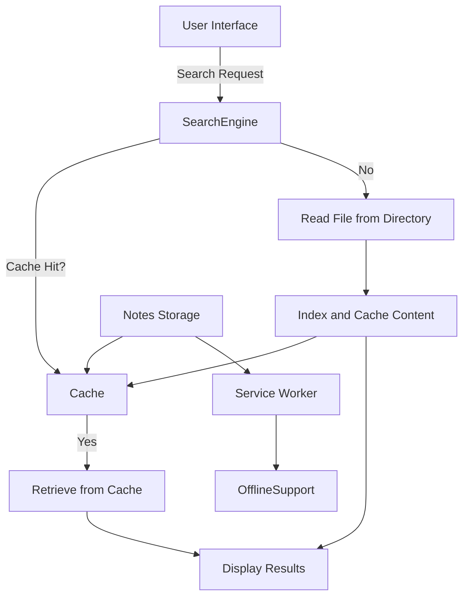

# Client-Side Cache-Based Search Engine

A lightweight, database-free search engine designed to provide quick and efficient search capabilities for static content (HTML, TXT, MD files) and dynamic notes. This project enhances user experience with a client-side caching system that speeds up search retrieval, reduces server load, and offers offline functionality through service workers.

---

## Table of Contents
- [Client-Side Cache-Based Search Engine](#client-side-cache-based-search-engine)
  - [Table of Contents](#table-of-contents)
  - [Overview](#overview)
  - [Features](#features)
  - [How It Works](#how-it-works)
  - [System Architecture](#system-architecture)
  - [Installation](#installation)
  - [Usage](#usage)
  - [Configuration](#configuration)
    - [Cache Directory Settings](#cache-directory-settings)
    - [Cache Expiration](#cache-expiration)
  - [Screenshots](#screenshots)
    - [1. Home Screen](#1-home-screen)
    - [2. Search Results](#2-search-results)
    - [3. Offline Access](#3-offline-access)
    - [4. Note-Taking Feature](#4-note-taking-feature)
  - [Future Enhancements](#future-enhancements)
  - [License](#license)

---

## Overview
The **Client-Side Cache-Based Search Engine** aims to solve the problem of slow retrieval times in traditional database-driven systems, especially for small-scale applications. By leveraging client-side caching techniques, this project allows for quick access to static content and user-generated notes without the need for repeated server queries or a complex database setup. It also features offline search capabilities, enabling users to access frequently used files and notes even without a network connection.

---

## Features
- **Fast Search**: Quickly indexes and retrieves content from local static files (HTML, TXT, MD) and user-generated notes.
- **Client-Side Caching**: Frequently accessed files are cached locally, reducing load times and minimizing server requests.
- **Offline Access**: Integrated service worker allows users to search and access files and notes while offline.
- **Note Management**: Includes a simple note-taking application, allowing users to create, edit, and save notes, which are also cached for fast retrieval.

---

## How It Works
1. **File Indexing**: Files in designated directories are indexed upon first search and cached to enable faster access.
2. **Client-Side Caching**: Indexed content is stored in a cache, allowing the search engine to skip file reads for frequently accessed files.
3. **Service Worker**: A service worker caches essential files and provides offline support, making notes and static content available without internet connectivity.
4. **Real-Time Retrieval**: Dynamic notes are cached immediately after creation, enabling instant access both online and offline.

---

## System Architecture
The system is designed around a client-side caching and service worker model, eliminating the need for a database. Here’s a simplified architecture:



---

## Installation
Follow these steps to set up the project locally:

1. **Clone the Repository**
   ```bash
   git clone https://github.com/vansh-codes/Client-Side-Cache-Based-Search-Engine.git
   ```
2. **Navigate to the Directory**
   ```bash
   cd Client-Side-Cache-Based-Search-Engine
   ```
3. **Set Up XAMPP or Local PHP Server**
   - Place the project in the appropriate XAMPP directory (e.g., `C:/xampp/htdocs/`).
   - Start the Apache server.

4. **Access the Project**
   Open your browser and go to `http://localhost/Client-Side-Cache-Based-Search-Engine`.

---

## Usage
1. **Search Content**: Use the search bar to look for keywords within indexed files and notes.
2. **Note-Taking**: Create and save notes, which will be cached for quick access and offline availability.
3. **Offline Access**: After the first access, files and notes can be accessed offline using the service worker.

---

## Configuration
### Cache Directory Settings
Set the directory paths for content and note storage in the configuration file:

- **`CACHE_DIR`**: Path to store cached files.
- **Content Folder**: Modify the path for static files under the `content/` directory.
- **Notes Folder**: Modify the path for dynamic notes under the `notes/` directory.

### Cache Expiration
Adjust cache expiration settings to clear outdated files and refresh content as needed.

---

## Screenshots
### 1. Home Screen


### 2. Search Results


### 3. Offline Access


### 4. Note-Taking Feature


---

## Future Enhancements
- **Advanced Search Capabilities**: Implement fuzzy search and keyword highlighting for more intuitive searches.
- **Enhanced Cache Management**: Introduce cache expiration policies for better storage management.
- **Multi-Format Note-Taking**: Support additional note formats (TXT, MD, HTML) and automatically cache them for faster retrieval.

---

## License
This project is licensed under the MIT License. See the [LICENSE](./LICENSE) file for details.

---

**Enjoy fast, efficient, and offline-capable searches!**
